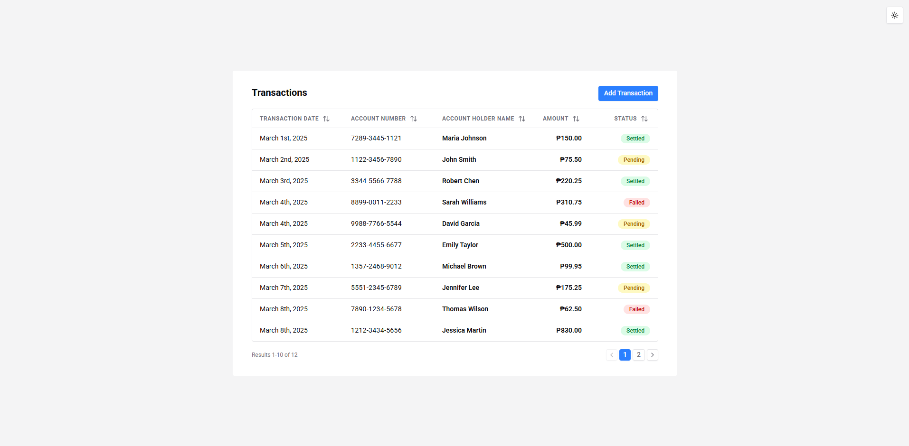
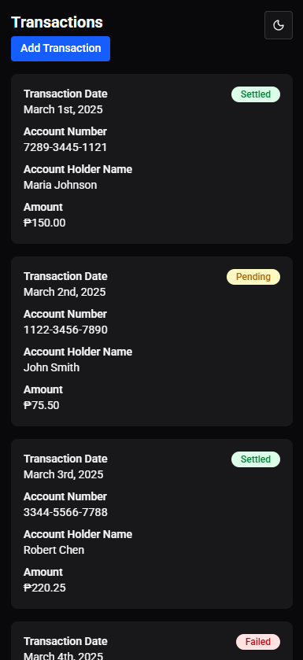
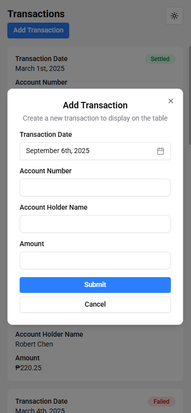
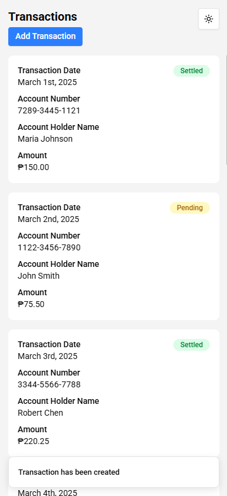

# Transaction Management System

An full-stack application built with [**Node.js**](https://nodejs.org/en) and [**Express**](https://expressjs.com/) for the backend API and [**React (TypeScript)**](https://react.dev/) with [**Shadcn UI**](https://ui.shadcn.com/) for the frontend.

The system allows users to view and add transactions, storing all transaction data in a **CSV file**. It features a responsive user interface and handles basic input validation and error states.

## Getting Started

### Prerequisites

-   **Node.js** 20.6+ (tested with 24.5.0)
-   **npm** 10+ (tested with 11.5.1)
-   A modern web browser (latest Chrome/Firefox/Edge)

### Installation

1. **Open a terminal** (Command Prompt or PowerShell for Windows, Terminal for macOS or Linux)

2. **Ensure Git is installed** (Visit [https://git-scm.com](https://git-scm.com) to download and install Git if it’s not already installed.)

3. **Clone the repository**

```bash
git clone https://github.com/jpatrickldg/transaction-management-system.git

```

4. **Navigate to the project directory**

```bash
cd transaction-management-system
```

5. **Navigate to the backend folder and install dependencies**

```bash
cd backend
npm install
```

6. **Navigate to the frontend folder and install frontend dependencies**

```bash
cd ../frontend
npm install
```

### Configuration

Both the backend and frontend require environment variables to run. For this project, the `.env.example` files already contain working values, so you don't need to edit them. You just need to **copy and rename the file to `.env`**.

1. **Backend** <br>
   Navigate to the backend folder and create the `.env` file:

```bash
cd backend
cp .env.example .env # Linux/macOS
# or
copy .env.example .env # Windows PowerShell
```

2. **Frontend** <br>
   Navigate to the frontend folder and create the `.env` file:

```bash
cd ../frontend
cp .env.example .env # Linux/macOS
# or
copy .env.example .env # Windows PowerShell
```

### Running the Application

Once the dependencies are installed and the `.env` files are in place, you can start both the backend and frontend.

1. **Start the Backend** <br>
   Open a terminal, go to the project root folder, and start the backend server:

```bash
cd backend
npm start
```

By default, the backend server will run at `http://localhost:8000` as defined in the `.env` file.

2. **Start the Frontend** <br>
   Open a new terminal window or tab (so the backend keeps running). <br>
   From the project root folder, navigate to the frontend folder and start the app:

```bash
cd frontend
npm run dev
```

By default, the frontend app will run at http://localhost:5173 and may automatically open in your browser.

3. **Access the Application**

-   Open your web browser and go to the URL shown in the terminal (usually http://localhost:5173).
-   You should now see the Transaction Management System interface.

4. **Stop the servers**

-   Press `Ctrl + C` in each terminal window to stop the servers.

### API Documentation

The backend provides the following endpoints:

1. **Get All Transactions**

**Endpoint:**

```bash
GET api/transactions
```

**Sample Response:**

```json
[
    {
        "transactionDate": "2025-03-01",
        "accountNumber": "728934451121",
        "accountHolderName": "Maria Johnson",
        "amount": 150,
        "status": "Settled"
    },
    {
        "transactionDate": "2025-03-02",
        "accountNumber": "112234567890",
        "accountHolderName": "John Smith",
        "amount": 75.5,
        "status": "Pending"
    }
]
```

2. **Add a New Transaction**

**Endpoint:**

```bash
POST api/transactions
```

**Sample Request Body:**

```json
{
    "transactionDate": "2025-03-03",
    "accountNumber": "334455667788",
    "accountHolderName": "Robert Chen",
    "amount": 220.25
}
```

**Sample Response:**

```json
{
    "transactionDate": "2025-03-03",
    "accountNumber": "334455667788",
    "accountHolderName": "Robert Chen",
    "amount": 220.25,
    "status": "Pending"
}
```

**Note:** All requests and responses uses **JSON**.

### Testing

1. **Backend**

-   Uses [Vitest](https://vitest.dev/) and [Supertest](https://www.npmjs.com/package/supertest) for testing API endpoints.
-   To run the tests, open a terminal, navigate to the backend folder, then run the tests:

```bash
cd backend
npm run test
```

2. **Frontend**

-   Uses Vitest along with [React Testing Library](https://testing-library.com/docs/react-testing-library/intro/) to test components and UI behavior.
-   To run the tests, open a terminal, navigate to the frontend folder, then run the tests:

```bash
cd frontend
npm run test
```

**Note:** Both backend and frontend tests **don't require servers to be running**.

## Screenshots

The application is **mobile responsive** and supports **light and dark mode**. Key views are shown below:

**Transactions Table**






**Transaction Form**




**Transaction Form Errors**


**Transaction Form Added**



